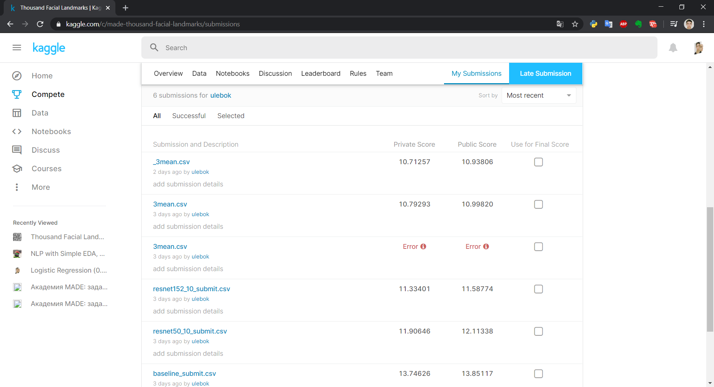

Ввиду некоторых обстоятельств, не смог уделить много времени этому соревнованию. Поэтому стратегия была простая: взять готовые архитектуры, обучить на датасете соревнования и усреднить с разными весами (вес подбирался интуитивно в зависимоти от mse на валидации).
Пробовал 4 известные архитектуры - ResNet18, ResNet50, ResNet101, ResNet152. Но в конечный сабмит пошли результаты трех. (ResNet101 не успела обучится до конца соревнования)

Что бы хотел сделать, но не успел:
- Анализ тренеровачного набора на наличие нетипичных картинок (можно искать выбросы, например, в отошениях расстояний между ключевыми точками лица) с последующей чисткой.
- Аугментация (повороты, шум, яркость/контраст)
- Подбор оптимизаторов, lr_scheduler
- Анализ ошибок, возможно с последующим взвешиванием сэмплов или ключевых точек

